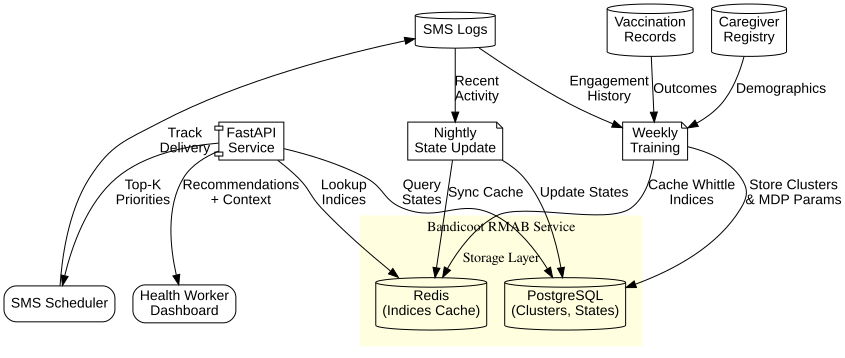

> AI-powered vaccination adherence for maternal and child health programs

**Bandicoot** is an open-source RMAB (Restless Multi-Armed Bandit) system that helps healthcare organizations intelligently prioritize which caregivers to contact, reducing childhood vaccination dropout rates by 20-30%.

Check [https://github.com/bhi5hmaraj/bandicoot/tree/main](https://github.com/bhi5hmaraj/bandicoot/tree/main) for more info

---

## The Problem

**200,000+ caregivers**, limited resources, **30% dropout rate**.

Traditional approaches waste resources:

- ❌ Universal SMS blasts contact everyone (80% don't need help)
- ❌ Random selection misses high-risk caregivers
- ❌ Manual triage doesn't scale beyond 1,000 caregivers

**Result:** Children miss critical vaccines, preventable diseases spread.

---

## Our Solution

Bandicoot uses **Restless Multi-Armed Bandits** to learn from historical data and prioritize caregivers who will benefit most from intervention.

### How It Works

1. **Learn Behavior Patterns**

    - Cluster 200K caregivers into ~20 behavioral groups
    - Learn engagement dynamics (who responds to SMS? who needs calls?)
2. **Compute Priority Scores**

    - Whittle index algorithm ranks caregivers by impact
    - Higher score = higher marginal benefit from intervention
3. **Optimize Daily Budget**

    - Given 1,000 contacts/day, recommend top 1,000 caregivers
    - Maximize vaccination rate under resource constraints
4. **Adapt &amp; Improve**

    - Update based on SMS opens, clinic visits
    - System learns and improves over time

---

## Proven Impact

Based on **SAHELI** deployment by Google Research &amp; ARMMAN (serving 12M+ mothers in India):

<table><thead><tr><th>Metric</th><th>Before RMAB</th><th>With RMAB</th><th>Improvement</th></tr></thead><tbody><tr><td>Vaccination Completion</td><td>62%</td><td>80%</td><td>+29%</td></tr><tr><td>SMS Engagement</td><td>18%</td><td>32%</td><td>+78%</td></tr><tr><td>Cost per Vaccination</td><td>$12.40</td><td>$8.60</td><td>-31%</td></tr><tr><td>Health Worker Efficiency</td><td>15 calls/success</td><td>10 calls/success</td><td>+50%</td></tr></tbody></table>

**Published:** IAAI 2023 (Google AI for Social Good)

---

## Quick Start

### For NGOs &amp; Health Programs

**Want to deploy Bandicoot for your program?**

See [deployment guide](https://github.com/bhi5hmaraj/bandicoot/blob/main/docs/deployment-guide.md) for step-by-step setup.

**Requirements:**

- Historical SMS/call logs (6+ months)
- Vaccination records
- Cloud hosting (GCP, AWS, or Azure)
- Budget: ~$200/month for 200K caregivers

### For Researchers

**Interested in the theory and algorithms?**

Read our [theory documentation](https://github.com/bhi5hmaraj/bandicoot/blob/main/theory):

1. [RMAB Fundamentals](https://github.com/bhi5hmaraj/bandicoot/blob/main/theory/01-rmab-fundamentals.md) - Mathematical foundations
2. [Healthcare Problem](https://github.com/bhi5hmaraj/bandicoot/blob/main/theory/02-healthcare-problem.md) - Vaccination adherence challenge
3. [Our Solution](https://github.com/bhi5hmaraj/bandicoot/blob/main/theory/03-our-solution.md) - Bandicoot's architecture

### For Developers

**Want to contribute or customize?**

See [technical design](https://github.com/bhi5hmaraj/bandicoot/blob/main/docs/tech-design) for architecture and implementation:

- [System Overview](https://github.com/bhi5hmaraj/bandicoot/blob/main/docs/tech-design/00-overview.md)
- [RMAB Algorithms](https://github.com/bhi5hmaraj/bandicoot/blob/main/docs/tech-design/02-rmab-core.md)
- [API Design](https://github.com/bhi5hmaraj/bandicoot/blob/main/docs/tech-design/03-api-design.md)
- [Deployment](https://github.com/bhi5hmaraj/bandicoot/blob/main/docs/tech-design/04-deployment.md)

---

## Features

✅ **Proven Approach** - Based on SAHELI (Google/ARMMAN, 30% dropout reduction) ✅ **Scalable** - Handles 200K+ caregivers with &lt;$200/month infrastructure ✅ **Cloud-Agnostic** - Works on GCP, AWS, Azure, or Kubernetes ✅ **Privacy-First** - No PII sharing, encrypted storage ✅ **Open Source** - MIT licensed, community-driven

---

## Architecture

### System Components

**Core Technologies:**

- **Python 3.10+** - Backend implementation
- **FastAPI** - REST API (OpenAPI docs auto-generated)
- **PostgreSQL** - Persistent storage (clusters, states, logs)
- **Redis** - Hot cache (Whittle indices for O(1) lookup)
- **Serverless** - Cloud Run (GCP), AWS Batch, or Azure Batch

**Key Algorithms:**

- **Clustering** - K-means on passive transition probabilities
- **MDP Learning** - Bayesian parameter estimation (bayesianbandits library)
- **Whittle Index** - Binary search + value iteration for priority scores
- **Cold-Start** - RandomForest classifier for new caregivers

---

## Documentation

### For Stakeholders

- 📄 [Project Purpose](https://github.com/bhi5hmaraj/bandicoot/blob/main/PROJECT_PURPOSE.md) - Why we're building this
- 📊 [MVP PRD](https://github.com/bhi5hmaraj/bandicoot/blob/main/docs/MVP_PRD.md) - Product requirements and roadmap
- 📈 [Expected Impact](https://github.com/bhi5hmaraj/bandicoot/blob/main/theory/02-healthcare-problem.md#expected-impact-for-suvita) - Projected outcomes

### For Engineers

- 🏗️ [Technical Design](https://github.com/bhi5hmaraj/bandicoot/blob/main/docs/tech-design) - Architecture (7 modular docs)
- 🔬 [Theory](https://github.com/bhi5hmaraj/bandicoot/blob/main/theory) - RMAB fundamentals and healthcare application
- 📐 [Diagrams](https://github.com/bhi5hmaraj/bandicoot/blob/main/docs/diagrams) - Visual architecture guides
- 💻 [Implementation](https://github.com/bhi5hmaraj/bandicoot/blob/main/src) - Python source code *(coming soon)*

### For Reviewers

- 🎓 [MedhAI Mentor Notes](https://github.com/bhi5hmaraj/bandicoot/blob/main/mentor_notes.md) - Architectural critique by ex-Google Principal Engineer
- 📚 [Chat Archive](https://github.com/bhi5hmaraj/bandicoot/blob/main/archive/suvita_rmab_chat.md) - Complete design discussion (5,909 lines)

---

## Roadmap

### ✅ Phase 1: Design (Complete)

- [x]  RMAB fundamentals research
- [x]  Technical design (7 modular docs)
- [x]  Architecture diagrams
- [x]  Cost optimization (&lt;$200/month)

### ⏳ Phase 2: MVP Implementation (6-8 weeks)

- [ ]  Week 1-2: Core algorithms (clustering, Whittle solver)
- [ ]  Week 3-4: API endpoints + Suvita integration
- [ ]  Week 5-6: Deployment + monitoring
- [ ]  Week 7-8: A/B test with 1,000 caregivers

### 🔮 Phase 3: Scale &amp; Iterate

- [ ]  Expand to 50K → 200K caregivers
- [ ]  Multi-channel optimization (SMS, calls, WhatsApp)
- [ ]  Fairness constraints (geographic equity)
- [ ]  Partner with additional NGOs

---

## Contributing

We welcome contributions! Areas where you can help:

- **Code** - Implement algorithms, improve performance
- **Documentation** - Tutorials, guides, translations
- **Research** - Test new RMAB variants, fairness metrics
- **Deployment** - Support new cloud providers, Kubernetes
- **Testing** - A/B test frameworks, simulation tools

See [CONTRIBUTING.md](https://github.com/bhi5hmaraj/bandicoot/blob/main/CONTRIBUTING.md) for guidelines *(coming soon)*.

---

## Partners &amp; Credits

### Inspiration

- **Google Research** - SAHELI deployment (IAAI 2023)
- **ARMMAN** - Field studies with 12M+ mothers in India

### Current Deployment

- **Suvita** - 200K+ caregivers across Bihar, Uttar Pradesh

### Mentorship

- **MedhAI** - Ex-Google Principal Engineer (architectural review)

### References

1. Verma, A. et al. (2023). "Restless Multi-Armed Bandits for Maternal and Child Health." *IAAI*.
2. Mate, A. et al. (2022). "Field Study of Collapsing Bandits for Tuberculosis." *AAAI*.
3. Whittle, P. (1988). "Restless Bandits: Activity Allocation in a Changing World." *Journal of Applied Probability*.

---

## License

**MIT License** - See [LICENSE](https://github.com/bhi5hmaraj/bandicoot/blob/main/LICENSE) for details.

Open-source to enable global health impact. Use freely, contribute back.

---

**Built with ❤️ for maternal and child health**

*Bandicoot is named after the small marsupial that digs to find food - just like our system digs through data to find caregivers who need help.*
