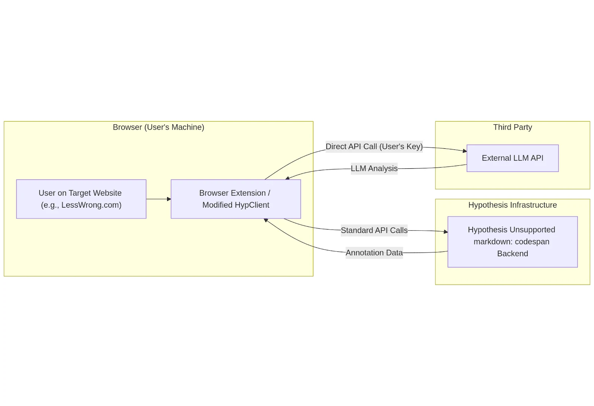
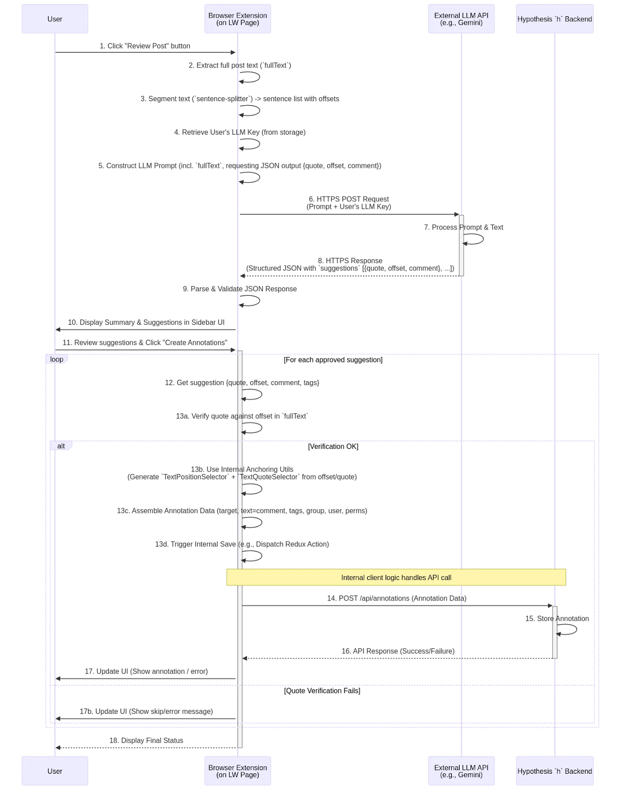

Hypothes.is with collaboration with LLMs, superseded by RIO

## 1.1. Problem Statement:

Engaging deeply with complex web content often involves critical reading, analysis, identifying key claims, evaluating arguments, and considering different perspectives. This process can be demanding and time-consuming. While Large Language Models (LLMs) possess powerful text analysis capabilities, effectively integrating their insights directly into a user's reading and annotation workflow remains a challenge. There's a need for tools that seamlessly connect LLM analysis to specific text segments within a web page, allowing users to leverage AI for tasks like summarizing passages, identifying stylistic features, flagging claims for verification, generating critiques from specific viewpoints, or simply getting a different "reading" of the text, all anchored directly to the source content. An initial concrete use case is assisting reviewers on platforms like LessWrong in evaluating content against specific site policies (such as their LLM usage policy), but the potential application is much broader.

## [Hypothes.is](http://hypothes.is)

## 1.2. PoC Goals:

The primary goal of this project is to develop a Proof of Concept (PoC) tool to validate the core ideas of using LLMs, integrated with the Hypothesis annotation system, to assist users in reading and reviewing web content. Specific goals for this PoC are:

Validate Content Extraction &amp; Segmentation: Determine the feasibility of reliably extracting main content text from target websites (initially LessWrong) and segmenting it using client-side JavaScript (sentence-splitter) to obtain accurate character offsets.

Validate Client-Side LLM Interaction: Test the feasibility of making direct calls to an external LLM API (using user-provided API keys for the PoC) from within a browser extension to analyze content based on potentially configurable prompts.

Validate Results Display: Test displaying the LLM analysis results (structured JSON containing quotes, offsets, comments) within the existing Hypothesis client sidebar UI.

Explore Programmatic Annotation: Investigate the technical challenges and feasibility of creating Hypothesis annotations automatically or semi-automatically (anchored using character offsets and quotes) based on LLM suggestions, by interacting with the Hypothesis client's internal mechanisms.

Minimize Initial Infrastructure: Specifically for this PoC, avoid the need for a dedicated backend service by performing all logic, including LLM API calls, within the browser extension itself.

Initial Use Case Focus: While designing for potential generality, use the LessWrong LLM policy review task as the first concrete example to drive prompt design and testing.

## 1.3. Non-Goals (for PoC):

This PoC will not aim to achieve:

A Configurable Prompt UI: While the potential for configurable prompts is a goal, the PoC will likely start with hardcoded prompts focused on the initial use case.

Production-Ready Security: Providing a secure method for users to manage or use LLM API keys is explicitly out of scope for this PoC. The client-side key handling is insecure.

Scalable Backend Service: No backend service for LLM calls will be built.

Robust Handling of Long Content: The PoC may not handle content exceeding LLM context limits effectively.

Polished User Experience: Focus is on technical validation.

General Website Support: The PoC's content extraction will initially target LessWrong.

Fully automated moderation or replacing human judgment.

## 1.4. Proposed PoC Solution Overview:

The proposed solution for this PoC is a Client-Side Only Browser Extension. A new browser extension (initially for Chrome/Firefox), built upon or modifying the Hypothesis client codebase, will activate on target websites (starting with lesswrong.com). Users participating in the PoC must configure the extension with their own API key for a designated LLM service (e.g., Google Gemini).

When triggered by the user, the extension will:

Extract the main text content of the currently viewed web page.

Use the integrated sentence-splitter library to segment the text and record character offsets.

Construct a prompt (initially focused on the LessWrong LLM policy use case, but designed with future configurability in mind) requesting analysis and asking for structured JSON output that includes specific quotes, their start offsets, and review comments/analysis.

Directly call the external LLM API from the browser using the user-provided API key stored (insecurely for the PoC) in browser storage.

Parse the LLM's JSON response.

Display the suggested review points/analysis (quote, comment) within a dedicated area in the Hypothesis sidebar.

Provide a mechanism for the user to approve suggestions, triggering the extension to attempt creating corresponding Hypothesis annotations anchored using the provided offsets and quotes via the client's internal APIs.

This PoC architecture prioritizes rapid validation of the core client-side mechanics and LLM-Hypothesis integration, accepting the security limitations of browser-side key handling for this initial phase. The design allows for future adaptation to different review criteria or LLM personas via modified prompts.

## 2. Architecture (Client-Side Only PoC)

This Proof of Concept (PoC) adopts a streamlined, client-centric architecture to validate the core functionality while minimizing initial infrastructure requirements. All new logic, including communication with the external LLM service, resides within a modified browser extension based on the Hypothesis client.

## 2.1. High-Level Diagram:

The diagram below illustrates the components involved and their interactions in this client-side only PoC:

The user interacts with the target website via the browser, where the extension is active.

The extension, when triggered, extracts content and sends it directly to the external LLM API using an API key provided by the user and stored (insecurely for PoC) within the extension.

The LLM API processes the request and sends the analysis results back directly to the extension.

The extension displays the results. If the user chooses to save an annotation, the extension uses standard Hypothesis mechanisms to send the annotation data to the main Hypothesis h backend.

The Hypothesis h backend stores/retrieves annotation data as usual.

## 2.2. Component Descriptions:

### 2.2.1. Browser Extension (Modified Hypothesis Client):

Nature: The sole new software component developed for this PoC, delivered as a browser extension (e.g., for Chrome/Firefox). It is built upon a fork or modification of the existing hypothesis/client codebase.

Responsibilities:

Injecting itself and activating on designated target websites (initially lesswrong.com).

Providing the User Interface (UI) trigger for initiating LLM analysis (e.g., a button or menu item).

Handling user configuration, specifically the input and insecure storage (e.g., browser.storage.local) of their personal LLM API key, with appropriate security warnings.

Extracting the relevant text content from the target web page.

Performing client-side sentence segmentation using sentence-splitter to get text and character offsets.

Constructing appropriate prompts for the external LLM API.

Making direct HTTPS requests to the external LLM API endpoint, authenticating using the stored user API key.

Receiving and parsing the structured JSON response from the LLM.

Displaying the analysis results (summary, suggested annotations) within the Hypothesis sidebar UI.

Handling user interaction for approving/discarding suggested annotations.

Utilizing internal Hypothesis client mechanisms (anchoring utilities, state management/actions) to find quote locations based on offsets/text and trigger the creation of new Hypothesis annotations.

Communicating with the standard Hypothesis h backend via its existing APIs for user authentication (Hypothesis account login within the sidebar) and annotation storage/retrieval.

### 2.2.2. Hypothesis h Backend:

Nature: The existing production Hypothesis service backend.

Responsibilities: Standard Hypothesis backend functions: user account management, authentication (session/token handling), group management, and CRUD operations for annotations.

Changes Required for PoC: None.

### 2.2.3. External LLM API:

Nature: A third-party service provided by companies like Google (Gemini), OpenAI (GPT models), Anthropic (Claude), etc.

Responsibilities: Receiving text and prompts, performing generative AI analysis, returning results (configured to return structured JSON).

Interaction: Called directly from the user's browser via the extension using the user's own API key.

## 2.3. Generality:

While the initial PoC focuses on LessWrong and its LLM policy, the core architectural pattern is potentially applicable to other websites and different analysis tasks. The primary components that would require modification for other sites or tasks are:

Content Extraction Logic: The JavaScript code responsible for identifying and extracting the main text content from a webpage is highly site-specific and would need custom implementation for each new target website structure. Access to pre-structured data with offsets (like the lw-post.json example) would significantly simplify this but cannot be generally assumed.

LLM Prompts: The prompts sent to the LLM would need to be tailored to the specific review criteria, policies, or analysis tasks relevant to the target website or the desired user goal (e.g., summarizing, fact-checking, different points of view).

UI Trigger: The method for initiating a review might need adaptation based on the target site's UI, though a generic browser action button or context menu could work across sites.

The fundamental process of client-side analysis trigger, direct LLM call (using user key in this PoC model), results display in the sidebar, and quote/offset-based annotation creation remains the same. The sentence segmentation and Hypothesis anchoring parts are inherently general.

3. # Detailed Design - Browser Extension (Client-Side Only PoC)

This section details the implementation plan for the browser extension component, which is the central piece of this client-side PoC architecture. It leverages and modifies the existing hypothesis/client codebase.

## 3.1. Core Modifications &amp; Codebase:

Foundation: The extension will be built upon a fork or branch of the hypothesis/client repository. It will reuse the existing sidebar UI framework (AngularJS/Preact components), annotation rendering, communication with the h backend, anchoring logic, and state management (Redux).

Key Modules to Modify/Extend:

Sidebar Application Bootstrap/Entry Point: To conditionally initialize new features.

UI Components:

Selection Popover (SelectionToolbar or similar) or Annotation Editor Toolbar (AnnotationEditor or similar) to add the trigger button for selected text review (if implemented).

Content Script / Browser Action: To add the trigger for full post review.

Sidebar Layout/Controller: To host the new panel for displaying LLM results.

Services/Utilities:

New logic/service for interacting with the External LLM API directly.

New logic/service for managing user-provided API keys.

Integration point with existing anchoring services (anchoring, text-range, text-quote modules or similar).

Integration point with existing annotation creation/saving logic (likely via Redux actions/reducers/middleware like sagas).

State Management (Redux):

New state slice(s) to store LLM analysis results (summary, suggestions), loading status, error messages.

New actions (e.g., REQUEST\_LLM\_REVIEW, LLM\_REVIEW\_RECEIVED, CLEAR\_LLM\_RESULTS, CREATE\_SUGGESTED\_ANNOTATIONS).

New reducers/selectors corresponding to the new state and actions.

Build Process: Adapt the existing hypothesis/client build process (yarn build, Rollup configuration) to include the new code and package it as a browser extension.

## 3.2. Activation:

Manifest Configuration (manifest.json):

Define content scripts to inject the necessary client bootstrapping code (boot.js or similar) into target pages.

Initially, restrict matches within content\_scripts and host\_permissions primarily to ://.lesswrong.com/\* and the chosen LLM API endpoint (e.g., [https://generativelanguage.googleapis.com/](https://generativelanguage.googleapis.com/)). Add [https://hypothes.is/](https://hypothes.is/) for standard API calls.

Declare necessary permissions: scripting, activeTab, storage (for API key storage).

Define a browser action (toolbar icon) as a potential trigger point for full-post review.

## 3.3. User Interface (UI):

LLM API Key Input:

Add a section to the extension's options page (or potentially within the sidebar settings panel if easily accessible).

Include an input field for the user to paste their LLM API key (e.g., Gemini API Key).

Display prominent warnings about the security risks of storing the key in the browser and advise using restricted keys if possible.

Provide a "Save Key" button that stores the key using browser.storage.local.set().

Provide a "Clear Key" button.

Review Trigger:

Full Post Review: Add a button to the browser action's popup window or inject a button near the post title on LessWrong pages via a content script. Clicking this triggers handleReviewPostClick.

(Optional - Selected Text Review): Add a "Review Selection (LLM)" button to the Hypothesis selection popover UI (that appears when text is selected). Clicking this triggers a similar flow but uses selected text instead of full post text.

Results Display:

Create a new dedicated panel or tab within the main Hypothesis sidebar UI.

This panel will display:

Loading indicators while waiting for the LLM response.

Error messages if the LLM call or parsing fails.

The overall summary (results.summary) if provided by the LLM.

A list of suggested annotations (results.suggestions), showing the quote (potentially truncated) and the review comment.

A button like "Create Suggested Annotations" or potentially individual accept/reject buttons per suggestion.

A "Clear Results" button.

This UI component will need to read its state from the Redux store.

## 3.4. Content Extraction (LW Specific for PoC):

Implement a JavaScript function within a content script or the main client bundle that:

Uses robust DOM selectors to identify the main content body of a LessWrong post (e.g., find element with class .post-body .body-text). Requires inspection of LW's HTML structure and is fragile.

Extracts the plain text content using element.innerText. This provides text closer to what the user sees and what sentence-splitter / anchoring will operate on. Handle potential errors if the element isn't found.

## 3.5. Sentence Segmentation:

Integrate the sentence-splitter library into the client's build process.

When a review is triggered:

Call sentenceSplitter.split(fullText) on the extracted plain text.

Store the resulting array of sentence objects (each containing raw text and range: \[start, end\] character offsets) in memory or component state for later use during annotation creation.

## 3.6. LLM API Communication (Direct Client-Side):

Implement an asynchronous JavaScript function (e.g., callReviewPostBackend or a more generic callLlmApi).

This function will:

Retrieve the user-stored LLM API key using browser.storage.local.get(\['llmApiKey'\]). Handle the case where the key is not set (prompt the user via the UI).

Determine the correct LLM API endpoint URL (e.g., for Gemini).

Construct the prompt dynamically, including the analysis instructions (requesting JSON with quote, offset, comment) and the fullText payload.

Use the fetch API to make a POST request directly to the LLM API endpoint.

Set appropriate headers, including Content-Type: application/json and the Authorization or specific API key header required by the LLM provider (e.g., x-goog-api-key for Gemini REST API).

Include the necessary request body, specifying the model, prompt, and crucially, configuring the structured JSON output using the LLM API's specific parameters (responseSchema, response\_mime\_type, etc.).

Await the response. Check response.ok. Handle HTTP errors (4xx, 5xx).

Parse the response body as JSON (response.json()).

Perform basic validation on the parsed JSON structure to ensure it contains the expected suggestions array (or handle errors if not).

Return the parsed data or throw an appropriate error.

## 3.7. Annotation Generation (Using Client Internals):

Implement the function triggered by user approval (e.g., createSuggestedAnnotations).

Retrieve the stored suggestions (\[{quote, start\_offset, comment, tags}, ...\]) and the original fullText.

Access Client Internals: Identify and obtain references to the necessary Hypothesis client services/modules/store dispatch function. This is the most implementation-dependent part. Look for:

anchoring or similar service: Responsible for finding text in the document.

TextQuoteAnchor / TextPositionAnchor or similar: Classes/functions used to represent/create different selector types.

annotationMapper or annotationCreator service/actions: Responsible for formatting and saving annotations via API calls or Redux state changes.

Redux store dispatch function.

Client state selectors (to get current groupid, userid, etc.).

Iterate Suggestions: Loop through each approved suggestion.

Verify Quote: Check fullText.substring(s.start\_offset, s.start\_offset + s.quote.length) === s.quote. Log/notify on mismatch and skip.

Generate Target:

Create TextPositionSelector: { type: "TextPositionSelector", start: s.start\_offset, end: s.start\_offset + s.quote.length }.

Create TextQuoteSelector: { type: "TextQuoteSelector", exact: s.quote }. (Prefix/suffix might be added later by client).

Combine: target = \[{ source: currentDocumentURL, selector: \[TextPositionSelector, TextQuoteSelector\] }\].

Assemble Data: Create the full annotation data object with target, text: s.comment, tags, uri, group, permissions, userid.

Trigger Save: Dispatch the appropriate Redux action (e.g., store.dispatch({ type: 'CREATE\_ANNOTATION', annotation: annotationData })) to initiate the save process through the client's existing infrastructure.

Handle Errors: Catch errors during anchoring or saving, provide feedback. Add delays if needed.

## 3.8. Hypothesis Authentication:

No changes needed here for the PoC. The extension relies on the user being logged into their standard Hypothesis account via the sidebar to have an identity associated with the created review annotations.

## 4. Data Flow (Client-Side Only PoC)

Initiation: The user triggers the review via a UI element provided by the extension.

Client-Side Prep: The extension performs all necessary preparation locally: extracting text, segmenting it using sentence-splitter, retrieving the user's LLM API key from browser storage, and constructing the detailed prompt for the LLM.

Direct LLM Call: The extension makes a direct HTTPS request to the external LLM's API endpoint, including the prompt and the user's API key for authentication with the LLM service.

LLM Response: The LLM processes the request and sends back the structured JSON containing the analysis results (hopefully matching the requested schema with quotes, offsets, comments, etc.).

Display: The extension parses this response and updates its UI (within the Hypothesis sidebar) to show the findings to the user.

Annotation Creation Trigger: The user decides which suggestions (if any) to turn into annotations and triggers the creation process via the extension's UI.

Anchoring &amp; Formatting: For each approved suggestion, the extension first verifies the quote against the offset. If successful, it uses its internal knowledge of the Hypothesis anchoring system to generate precise selectors (TextPositionSelector based on the offset, TextQuoteSelector based on the quote). It then assembles the complete annotation data structure required by the Hypothesis backend.

Saving via h: The extension triggers its standard internal annotation saving mechanism (e.g., dispatching a Redux action). This existing client logic then handles sending the formatted annotation data via a standard API call (POST /api/annotations) to the Hypothesis h backend, using the user's Hypothesis authentication token (obtained when they logged into the sidebar).

Feedback: The extension provides feedback to the user on the success or failure of creating each annotation.

---

## 6. Final Solution (Proof of Concept - Client-Side Only)

## 6.1. Chosen Approach Summary:

This Proof of Concept (PoC) implements the Client-Side Only Browser Extension architecture. The goal is to rapidly validate the core feasibility of using LLMs integrated with Hypothesis for content review, specifically targeting LessWrong posts initially. This approach minimizes initial infrastructure by performing all logic, including external LLM API calls, directly within the browser extension using user-provided API keys.

It is critical to reiterate that handling API keys directly within the browser extension presents significant security risks and is suitable only for this limited PoC phase among informed developers. A transition to a backend-mediated approach (Hybrid Model) is necessary for any production or wider testing deployment.

## 6.2. Architecture Recap:

The PoC consists of three main interacting entities:

1. Browser Extension (Modified Hypothesis Client): The core component containing all new logic. It extracts content, segments text, calls the LLM API, displays results in the Hypothesis sidebar, and triggers annotation creation.
2. External LLM API (e.g., Google Gemini): The third-party service providing the text analysis, called directly by the extension.
3. Hypothesis h Backend: The standard Hypothesis service used for user authentication (within the sidebar) and annotation storage/retrieval. No modifications are needed.

## 6.5. Key Decisions &amp; Trade-offs Summary:

- Architecture: Client-Side Only selected for PoC simplicity, avoiding initial backend setup.
- Trade-off: Insecure API key handling. Must be replaced by a backend proxy (Hybrid model) before any production use. Requires user to provide their own LLM key.

- Targeting: Sentence Segmentation + Character Offsets used client-side, with LLM prompted to return {quote, start\_offset, comment}.
- Trade-off: More robust than DOM IDs. Relies on LLM offset accuracy and client's ability to verify/anchor the quote using offsets and text. Requires access to client internal anchoring/saving mechanisms.

- UI: Leverage existing Hypothesis sidebar for displaying results and creating annotations.
- Trade-off: Familiar UI for Hypothesis users, but requires integrating new panels/logic into the client codebase.

- Scope: Initial focus on LessWrong LLM policy review.
- Trade-off: Provides a concrete test case, but content extraction and prompts need generalization for other sites/tasks.

## 6.6. Next Steps (Post-PoC):

Upon successful validation of the core concepts in this PoC, the next steps involve transitioning towards a production-ready solution:

1. Implement Review Backend Service: Build the secure backend service (e.g., using Firebase/Genkit or another stack) to proxy LLM calls.
2. Refactor Extension: Remove direct LLM calls and API key handling from the extension. Implement secure communication from the extension to the new Review Backend.
3. Robust Authentication: Implement a secure authentication mechanism between the extension and the Review Backend (e.g., leveraging Hypothesis session tokens, OAuth flow, or Firebase Auth).
4. Handle Long Content: Implement chunking/summarization in the Review Backend.
5. UI/UX Refinements: Improve the display of suggestions, provide editing capabilities, enhance error handling and user feedback.
6. Prompt Iteration: Continuously refine LLM prompts for better accuracy and relevance.
7. Generalization: Adapt content extraction and prompting logic to support other websites and review tasks.
