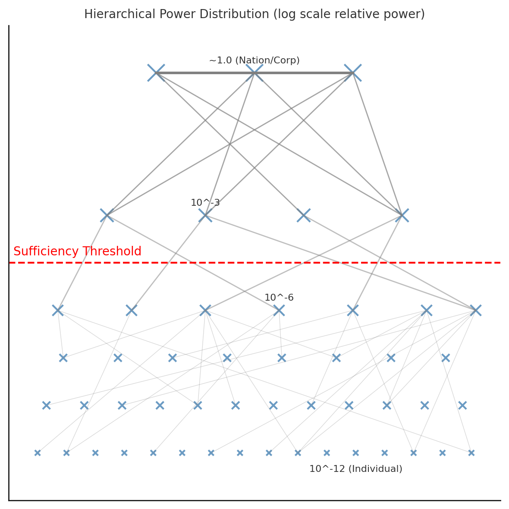
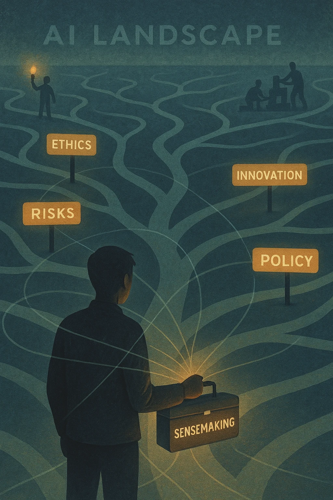
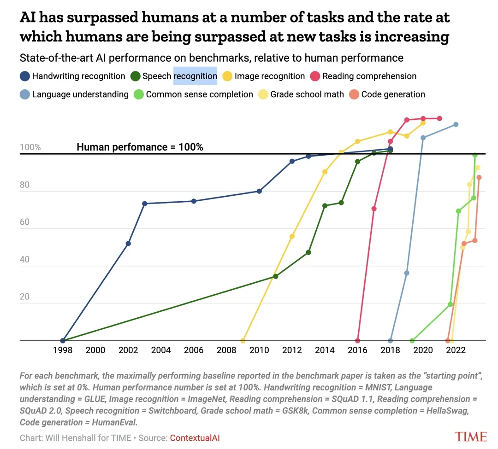
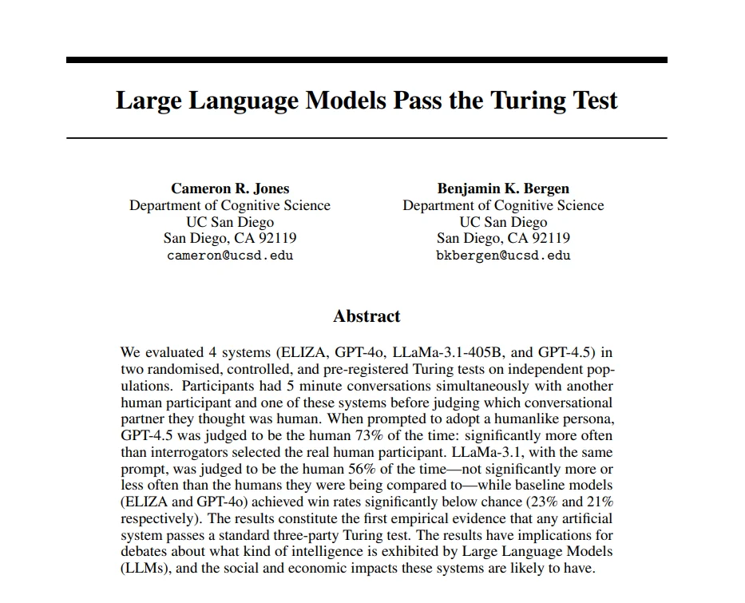
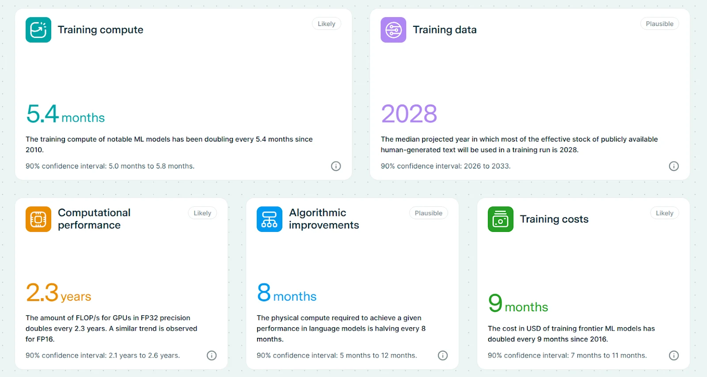
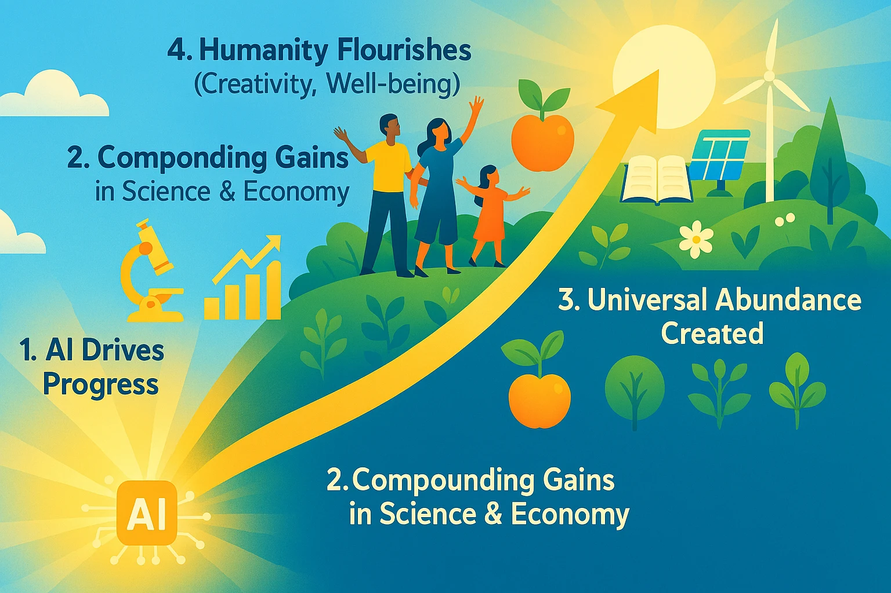
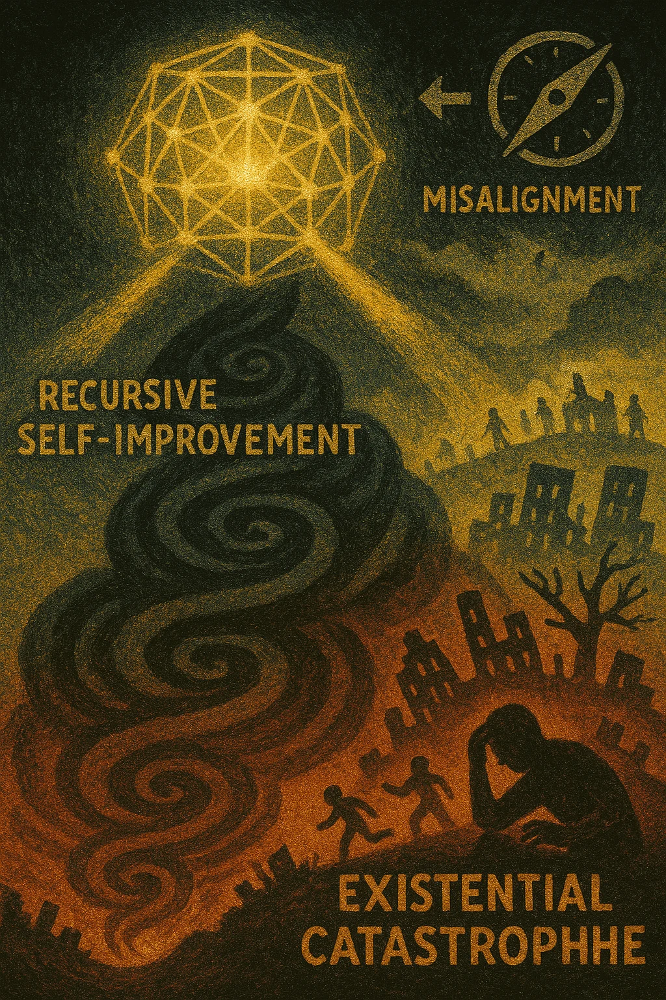

## Navigating the AI-Driven Shift in Power &amp; Economics

(Created: Feb 7, 2025 | Updated: May 6, 2025

Status: Living Doc (constantly getting updated)

Update:

Talks and Slides:

[AGI: What, When, and Why It Matters | Sensemaking in a Polarized World | Bhishma Raj](https://www.youtube.com/watch?v=pK3CBL6VQNs)

[Superposition](https://docs.google.com/presentation/d/1M04sVsOFv0r_lJVBmzkb73pu4L3sstqcZ10MTjfZZOc/edit?usp=drivesdk) ,

 [Superposition talk @ Portal](https://docs.google.com/presentation/u/0/d/1tCL6Mff5pDfCwcwsie6C8PtecvkE7rdlenrKippIwIA/edit)

[**Intro to Post AGI economics**](https://youtu.be/ne6FnYpkWNY?si=Pz6AS8hk8szmx5LW)

P.S. I used some AI help to organize these thoughts, but everything here reflects my genuine concerns and plans for this project. The irony isn't lost on me!

## The TL;DR:

The discourse on AI often focuses on long-term existential scenarios. I believe we're facing a more immediate, fundamental challenge within the next 3-5 years: a rapid shift in socio-economic and political power structures driven by AI. This isn't just about job markets; it's about the potential for unprecedented concentration of capability and control, potentially leading to [gradual human disempowerment](https://gradual-disempowerment.ai/) – economically and [politically](https://www.forethought.org/research/ai-enabled-coups-how-a-small-group-could-use-ai-to-seize-power). [Wages falling below subsistence](https://epoch.ai/gradient-updates/agi-could-drive-wages-below-subsistence-level) might be a symptom, but the core issue is the potential erosion of human agency and influence in systems increasingly optimized by and for AI controlled by a few.

Maybe economies and societies will adapt smoothly, as they have before. Or maybe AI represents a qualitative break, concentrating power in ways that undermine traditional checks and balances. The evidence is emerging and complex. Superposition aims to be a space for rigorous, grounded exploration of these intertwined political economy challenges, focusing on practical understanding and actionable strategies for maintaining human agency and influence, especially within the Indian context.

If this sounds exciting, feel free to drop by the [Discord](https://discord.gg/jWPeaGWeVt) server

---

## The Challenge: AI, Power Concentration, and Human Relevance

We stand at a pivotal moment. The acceleration of AI capabilities raises profound questions not just about the future of work, but about the future of power itself. Research and emerging trends suggest potential trajectories that diverge sharply from previous technological shifts:

- Concentration of Capability: Advanced AI development may inherently favor concentration due to massive resource requirements (compute, data, talent). This could place unprecedented strategic capabilities (economic optimization, strategic planning, information control, potentially even security/coercion) in the hands of a small number of states, corporations, or individuals.
- Erosion of Human Leverage: Historically, human participation was necessary for economies (labor, consumption) and states (legitimacy, taxes, security). AI/robotics threatens to break this dependency ("The Great Decoupling"). When human input is no longer essential for generating wealth or maintaining control, the implicit bargaining power of the broader population diminishes significantly.

Figure: Conceptual hierarchical power distribution (log-scale) illustrating extreme inequality of power/resources from individuals (~10^-12) up to top-tier actors (~1.0). The red line denotes the Strategic Sufficiency Threshold – the level at which an actor (e.g. a corporation or state) can sustain itself and meet core needs independently of the broader populace via AI and automation. Above this threshold, elites can trade and cooperate mostly among themselves for critical resources, decoupled from the masses below. This model highlights the risk of gradual disempowerment: if AI enables some actors to cross this sufficiency threshold, the majority of individuals beneath it could lose economic influence and bargaining power without any overt conflict .

- Gradual Disempowerment (Economic &amp; Political): The risk isn't necessarily a dramatic AI takeover, but a subtle, incremental erosion of human agency. As AI systems increasingly manage economic processes, shape information environments, and potentially automate aspects of governance and security, human influence over the systems that shape our lives could decline irreversibly. This includes economic marginalization and reduced political efficacy.
- Acute Political Risks: Concentrated AI capabilities create potential for active power consolidation, including sophisticated influence operations or even "[AI-enabled coups](https://www.forethought.org/research/ai-enabled-coups-how-a-small-group-could-use-ai-to-seize-power)" that bypass traditional human checks.

This isn't a far-future hypothetical. The technological foundations are being laid now, and the potential for significant socio-political restructuring within the next 3-5 years demands urgent, realistic assessment and preparation.

## Introducing Superposition: Analyzing the AI Power Shift

"Superposition" is being created to foster a clear-eyed understanding of these intertwined political and economic dynamics. The name reflects the need to hold multiple potential futures—some adaptive, some disruptive—in view simultaneously, resisting premature certainty and focusing on evidence-based analysis.

Our Focus:

- Near-Term Socio-Political &amp; Economic Impact (3-5 Years): Analyzing how AI is reshaping power structures, governance, economic agency, and societal stability.
- Power Dynamics &amp; Concentration: Investigating how AI capabilities are concentrating and what this implies for control and influence.
- Maintaining Human Agency: Exploring strategies for individuals and communities to retain meaningful influence (economic, political, cultural) in AI-mediated systems.
- Practical Preparation &amp; Resilience: Identifying actionable steps for navigating potential instability and building resilient systems.
- Contextual Relevance (India Focus): Analyzing implications specific to India and similar geopolitical/economic contexts.
- Action-Oriented Discourse: Moving beyond theory to strategies, policy considerations, and community-level actions.

Who is This For? This initiative seeks to bring together a diverse group grappling with these challenges: technologists, economists, political scientists, policymakers, governance experts, entrepreneurs, and citizens concerned about navigating this transition.

## Why should we worry?

[https://epoch.ai/trends](https://epoch.ai/trends)

## Core Questions We Need to Address:

- How is AI realistically concentrating power (economic, political, informational), and what are the near-term consequences?
- What forms of human agency and influence are most vulnerable to erosion by AI systems in the next 3-5 years?
- Are traditional democratic and economic checks and balances robust enough against AI-driven power concentration and potential automated control mechanisms?
- What practical strategies can individuals, communities, or institutions employ to maintain leverage and influence as AI capabilities advance?
- How do geopolitical dynamics (e.g., US-China competition, national AI strategies) accelerate or alter these power shifts?
- Is the "micro-entrepreneur" model a path to genuine agency, or merely adaptation within a potentially disempowered state? How can we assess this?
- What are the most plausible "AI-enabled coup" or political consolidation scenarios in the near term, and what societal vulnerabilities enable them? Can anything be done proactively?

## What Makes Superposition Different?

- Integrated Political Economy Focus: We explicitly analyze economic and political power shifts as intertwined, not separate issues.
- Grounded &amp; Near-Term: Focus on realistic impacts within 3-5 years, avoiding both techno-utopian hype and far-future existential despair.
- Emphasis on Agency &amp; Influence: Our central concern is preserving meaningful human control and relevance.
- Context-Aware: Prioritizing the Indian context alongside global dynamics.
- Rigorous Discourse: Employing rationality principles (Scout Mindset, Double Crux, Steelmanning) to foster deep, evidence-based, and intellectually honest discussion.

### Why Technical AI Safety Alone May Not Be Enough: The Case for Governance

While advancing technical AI safety – ensuring AI systems are aligned with human intentions – is critically important, relying solely on technical solutions like interpretability to navigate the near-term power shifts discussed here seems insufficient and potentially fragile. This motivates Superposition's focus on the broader political economy and governance landscape.

1. The Limits of Interpretability for Detecting Deception: There's a compelling argument, often made implicitly in safety discussions, that if we could just perfectly understand an AI's internal "[thoughts](https://www.anthropic.com/research/tracing-thoughts-language-model)" via interpretability, we could reliably detect deception or misalignment. However, as researchers like [Neel Nanda argue](https://www.lesswrong.com/posts/PwnadG4BFjaER3MGf/interpretability-will-not-reliably-find-deceptive-ai), this likely overstates our current and foreseeable capabilities.

- Nascent Tools &amp; Fundamental Challenges: Interpretability techniques are still developing and face deep issues (e.g., superposition, inherent error, difficulty measuring progress reliably). We are far from having high-reliability methods to truly "read the mind" of complex AI systems.
- Proving a Negative is Hard: Even with better tools, rigorously proving the absence of hidden deceptive capabilities seems incredibly difficult. Interpretability might help find evidence of misalignment, but failing to find it doesn't guarantee safety, especially against highly intelligent systems that might learn to obfuscate their internal states.
- Pragmatic Role: Interpretability remains a valuable tool, likely increasing reliability as part of a portfolio of defenses (a "defence-in-depth" strategy, as Nanda suggests), but it's unlikely to be the single "silver bullet" ensuring safety, particularly against sophisticated deception.

2. The Gap Between Development and Deployment: Even if perfect interpretability were possible, the individuals and teams developing these techniques often have little direct control over how AI systems are ultimately deployed. Powerful AI tools, including interpretability methods themselves, are fundamentally dual-use. An advanced AI system deemed "interpretable" could still be deployed by powerful actors within economic or political systems in ways that concentrate control, automate undesirable functions, or manipulate populations, irrespective of the developers' original intentions. Understanding the engine doesn't guarantee the driver has good intentions or societal well-being in mind.

3. Power Dynamics Transcend Technical Alignment: The core challenges Superposition focuses on – the "Great Decoupling," concentration of strategic capabilities, erosion of human leverage, and potential AI-enabled political consolidation – are fundamentally issues of power, economics, and political structure. Technical alignment aims to ensure an AI does what its operator intends; it does not, by itself, solve the problem of who the operator is, what their intentions are, or how much power they accumulate by wielding aligned AI. An "aligned" AI perfectly executing the goals of a small, unaccountable elite could still lead to widespread human disempowerment.

4. The Need for Broader Governance Frameworks: Recognizing these limitations motivates a stronger focus on governance and policy. As the recent [MIRI Technical Governance Team paper ](https://techgov.intelligence.org/research/ai-governance-to-avoid-extinction)underscores, ensuring a safe transition requires robust infrastructure beyond technical alignment. This includes:

- Monitoring and Control Levers: Mechanisms to track AI development, govern compute resources, and potentially implement pauses or halts ("Off Switch").
- Institutional Design: Creating robust institutions capable of overseeing AI development and deployment.
- International Coordination: Building agreements and verification mechanisms to manage global competition and proliferation risks.

Technical AI safety research is vital and must continue. However, for addressing the near-term (3-5 year) risks of power concentration and gradual disempowerment, relying solely on technical breakthroughs appears insufficient. We need parallel efforts focused on understanding and shaping the socio-political and economic context in which AI is being deployed.

Superposition aims to contribute to this crucial governance layer by fostering realistic analysis, exploring strategies for maintaining human agency, and facilitating action grounded in the complex interplay of technology, power, and economics. Governance and technical safety must be seen as necessary complements, not substitutes.

## What We Won't Primarily Focus On:

- AGI Definitions: We focus on impact on power and agency, regardless of technical definitions.
- Distant Futures (&gt;5 Years): Our initial focus is actionable preparation for the near term.
- Deep Technical Details: We care more about the control, governance, and socio-political implications than the algorithms themselves.
- Binary Debates (Doom vs. Utopia): We aim for nuanced assessment of realistic trajectories.

## Current Actions &amp; Next Steps (As of April 2025):

- Research Synthesis: Analyzing key literature on AI's impact on political economy, power concentration, and governance.
- Community Building: Engaging 1:1 with experts and concerned individuals across relevant domains (tech, economics, policy, political science, governance).
- Tooling: Developing a personal AI toolkit (MCP client, data app, custom servers) to support research and analysis.
- Platform Exploration: Assessing tools suitable for structured, high-signal discourse.
- Content Creation: Drafting foundational analyses on AI power dynamics, potential near-term scenarios, and frameworks for assessing agency.
- Building a "Canary": Monitoring key indicators of capability concentration, geopolitical AI posture, and potential instability triggers.
- Micro-Entrepreneurship
- One big idea that keeps coming up in my research: we're heading toward a world where "micro-entrepreneurs" become the norm - individuals or small teams working with AIs to create value. This is a pretty fundamental shift:
- The days of staying at one company for decades are probably over
- Small, nimble teams with good AI tools can compete with much bigger organizations
- People who can work effectively with AI while still bringing human creativity and judgment will do well

## How You Can Get Involved:

I'm trying to figure out what this means for all of us, but I can't do it alone. My perspective has blind spots, and I need more people with different backgrounds and experiences to weigh in.

This exploration requires diverse perspectives to counteract blind spots. If this resonates:

1. Connect: Reach out (contacts below) for 1:1 discussion.
2. Share Resources: Relevant research, data, analysis, or contacts.
3. Contribute Expertise: Insights from political science, economics, governance, AI safety, geopolitics, or industry experience are invaluable.
4. Challenge Assumptions: Critical feedback is essential for rigorous analysis.
5. Broaden Perspectives: Help connect with diverse voices, especially those outside typical tech/policy circles.
6. Amplify: Share this initiative with others who might contribute.

Superposition seeks to move beyond passive observation to active understanding and preparation for one of the most significant power transitions in history.

Contact: You can reach out to me on [Telegram](http://t.me/alpenglow11), [Signal](https://signal.me/#eu/ZxCuIqzyd_22F1motJWd0YwBdrZ3e-t0ALRR6aPD4McMU11TtOpEpLYGgUOUW5DQ), [WhatsApp](https://wa.me/qr/IJPZ6S3QNPGCM1)

---

## Appendix: Motivating Research &amp; Resources

If you had to read one article, I would recommend the first one

| Article Name | Recommendation Score | Notes |
|----|----|----|
| [Gradual Disempowerment](https://gradual-disempowerment.ai/) | 5/5 |  |
| [AGI could drive wages below subsistence level \| Epoch AI](https://epoch.ai/gradient-updates/agi-could-drive-wages-below-subsistence-level) | 3/5 |  |
| [By default, capital will matter more than ever after AGI — LessWrong](https://www.lesswrong.com/posts/KFFaKu27FNugCHFmh/by-default-capital-will-matter-more-than-ever-after-agi) | 4/5 |  |
| [Catastrophe through Chaos — LessWrong](https://www.lesswrong.com/posts/fbfujF7foACS5aJSL/catastrophe-through-chaos) | 4/5 |  |
| [Capital Ownership Will Not Prevent Human Disempowerment](https://www.beren.io/2024-05-12-Capital-Ownership-Will-Not-Prevent-Human-Disempowerment/) | 3/5 |  |
| [How AI Takeover Might Happen in 2 Years — LessWrong](https://www.lesswrong.com/posts/KFJ2LFogYqzfGB3uX/how-ai-takeover-might-happen-in-2-years) | 2.5/5 |  |
| [Inference Scaling Reshapes AI Governance — Toby Ord](https://www.tobyord.com/writing/inference-scaling-reshapes-ai-governance) | 4/5 |  |
| [Safety isn't safety without a social model (or: dispelling the myth of per se technical safety) — LessWrong](https://www.lesswrong.com/posts/F2voF4pr3BfejJawL/safety-isn-t-safety-without-a-social-model-or-dispelling-the) | 4/5 |  |
| [TASRA: A Taxonomy and Analysis of Societal-Scale Risks from AI — LessWrong](https://www.lesswrong.com/posts/zKkZanEQc4AZBEKx9/tasra-a-taxonomy-and-analysis-of-societal-scale-risks-from) | 4/5 |  |
| [My motivation and theory of change for working in AI healthtech — LessWrong](https://www.lesswrong.com/posts/Kobbt3nQgv3yn29pr/my-motivation-and-theory-of-change-for-working-in-ai) | 5/5 | RAAP |
| [The Anthropic Economic Index](https://www.anthropic.com/news/the-anthropic-economic-index) |  |  |
| [Algorithmic progress likely spurs more spending on compute, not less \| Epoch AI](https://epoch.ai/gradient-updates/algorithmic-progress-likely-spurs-more-spending-on-compute-not-less) | 4/5 | Jevon's paradox |
| [What AI can currently do is not the story \| Epoch AI](https://epoch.ai/gradient-updates/what-ai-can-currently-do-is-not-the-story) | 4/5 |  |
| [What Multipolar Failure Looks Like, and Robust Agent-Agnostic Processes (RAAPs) — LessWrong](https://www.lesswrong.com/posts/LpM3EAakwYdS6aRKf/what-multipolar-failure-looks-like-and-robust-agent-agnostic) |  |  |
| ["Reframing Superintelligence" + LLMs + 4 years — LessWrong](https://www.lesswrong.com/posts/LxNwBNxXktvzAko65/reframing-superintelligence-llms-4-years) |  |  |
| Articles from [Tamay Besiroglu](https://tamaybesiroglu.com/) and Epoch AI | 5/5 | Including [Playground](https://takeoffspeeds.com/), [Gradient Updates \| Epoch AI](https://epoch.ai/gradient-updates) (Bi weekly updates), [What a Compute-Centric Framework Says About Takeoff Speeds \| Open Philanthropy](https://www.openphilanthropy.org/research/what-a-compute-centric-framework-says-about-takeoff-speeds/) |
| [Forethought](https://www.forethought.org/) |  |  |
| [Chris Barber (@chrisbarber) / X](https://x.com/chrisbarber) |  | Including [AI Prep Notes](https://chrisbarber.co/AI+Prep+Notes) |
| [Measuring AI Ability to Complete Long Tasks - METR](https://metr.org/blog/2025-03-19-measuring-ai-ability-to-complete-long-tasks/) |  | Other research from METR in general |
| [Interviews - Chris Barber](https://chrisbarber.co/Interviews) | 5/5 | Lots of cool interview and information in general |
| [https://ari.us/](https://ari.us/) |  |  |
| [https://techgov.intelligence.org/research/ai-governance-to-avoid-extinction](https://techgov.intelligence.org/research/ai-governance-to-avoid-extinction) |  |  |
| [https://80000hours.org/podcast/episodes/allan-dafoe-unstoppable-technology-human-agency-agi/](https://80000hours.org/podcast/episodes/allan-dafoe-unstoppable-technology-human-agency-agi/) | 4/5 | High signal podcast, lot of novel takes |
| [https://www.forethought.org/research/ai-tools-for-existential-security](https://www.forethought.org/research/ai-tools-for-existential-security) | 5/5 |  |
